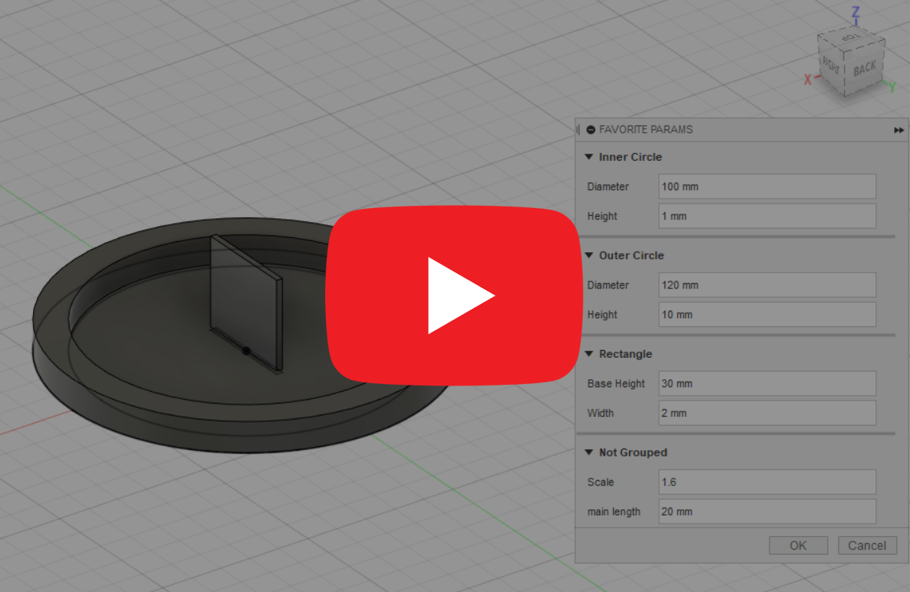
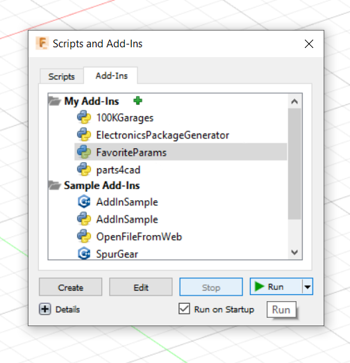
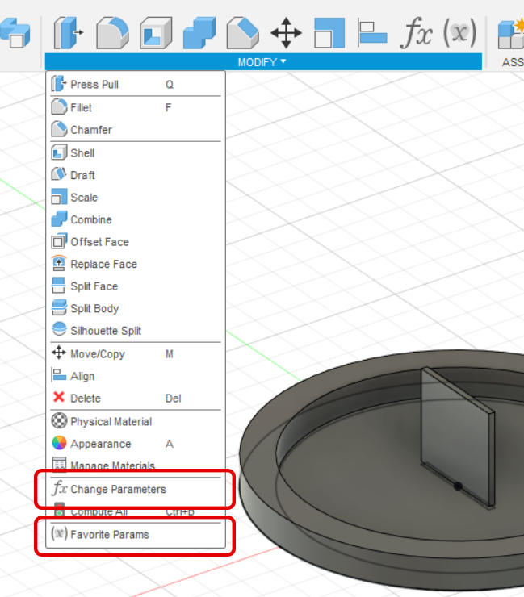
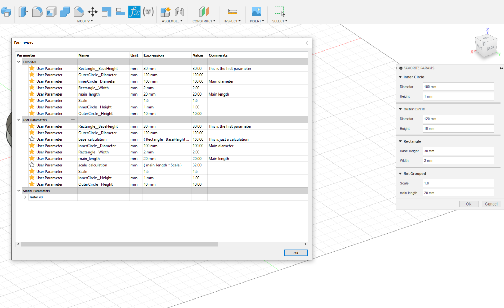

#  Favorite Params

This is an [Autodesk Fusion 360](http://fusion360.autodesk.com/) script that's used for simply editing favorite user parameters, grouped and sorted alphabetically.


[](http://www.youtube.com/watch?v=4voiojYiIVk "FavoriteParams Preview")

# Installation
1. [Click here to download Favorite Params](https://github.com/Maaggel/Favorite-Params/archive/master.zip)
2. Unzip the content of the zip file to the folder: %AppData%\Autodesk\Autodesk Fusion 360\API\AddIns

        (Ex: C:\Users\USERNAME\AppData\Autodesk\Autodesk Fusion 360\API\AddIns
3. Rename the folder from "Favorite-Params-master" to "FavoriteParams"
4. In Fusion 360, click on "Tools -> Add-Ins" and select the tab Add-Ins. Check "Run on Startup" and click on "Run"
    

## Using Favorite Params
1. Create or open a project
2. Create some favorited user parameters:  
Select Modify->Change Parameters

    
3. After creating your parameters, you can the easily edit them using the Favorite Params Addin
  - Select Modify->Favorite Params
  - Changes are now previewed live in the design
    

### Grouping
You can group the parameters by adding \"\_\_\" to the name. Everything before \"\_\_\" will be used as a group name. Ex.:
```
Group1__Something
Group1__SomethingElse
JustSomething
Group2__Group2Test
Group2__AnotherGroup2Test
Group2__YetAnotherGroup2Test
```
This will group the two starting with "Group1" in one group, and the tree starting with "Group2" in another group. And the "JustSomething" parameter will be added to a "Not Grouped" group.


## License
Samples are licensed under the terms of the [Apache 2.0](https://opensource.org/licenses/Apache-2.0). Please see the [LICENSE](LICENSE) file for full details.

## Developement
- Written by [Mikkel Bjørnmose Bundgaard](https://github.com/Maaggel)
